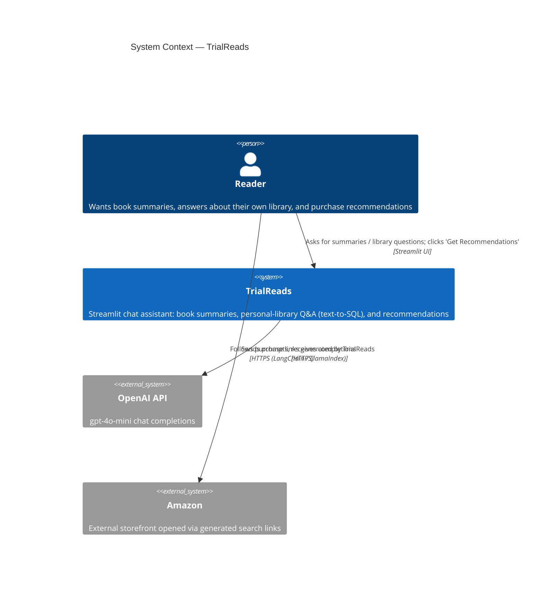
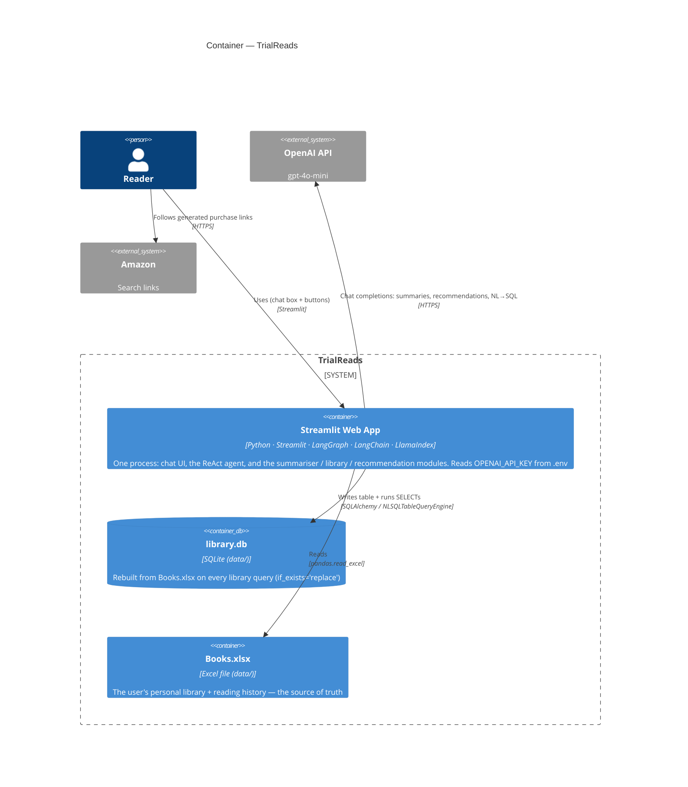
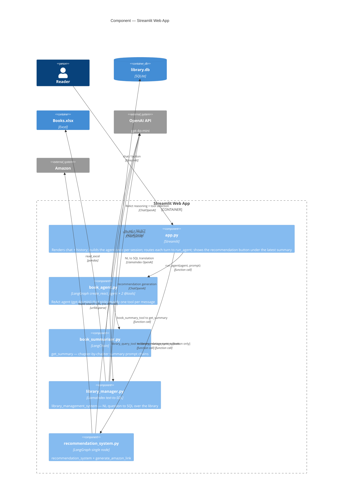
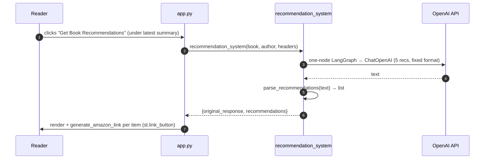

# Architecture — TrialReads (Book Summarizer & Library Manager)

C4-model architecture (System Context → Container → Component → Dynamic), grounded in the
actual code. Every node and relationship is cited to a file/symbol in the evidence tables —
spot-check any element against the source.

> **Legend.** ✅ *Verified from code* = backed by an `import`, function call, or string in
> the repo. ⚠️ *Inferred / runtime* = depends on runtime/external state (the OpenAI service,
> the LLM's tool choice, Streamlit `session_state`, the `.env` key) and can't be proven by
> static reading. In the C4 diagrams, dashed/`_Ext` boxes are external systems.

---

## What it is (one paragraph, from the code)

TrialReads is a **single Streamlit app** (`app.py`) that renders one chat box and delegates
every turn to a **LangGraph ReAct agent** (`book_agent.py`) over `gpt-4o-mini`. The agent has
**two tools**: summarize a named book (`book_summariser.get_summary`) and answer questions
about the user's **personal library via text-to-SQL** (`library_manager.library_management_system`,
LlamaIndex `NLSQLTableQueryEngine` over `data/Books.xlsx` → a throwaway SQLite DB). A third
feature — **recommendations** (`recommendation_system.py`, a one-node LangGraph) — is *not* a
tool; it's triggered by a Streamlit button under the latest summary. There is **no web server,
database server, or message queue**; the only external system is the **OpenAI API**, and
"Amazon" appears only as generated search-URL links the user can click.

---

## Level 1 — System Context



| Element | Evidence |
|---|---|
| TrialReads system | `app.py` `import streamlit as st`; `st.title("Trial Reads: ...")` |
| Reader uses it | `app.py:82` `st.chat_input(...)`; `app.py:70` `st.button("Get Book Recommendations")` |
| → OpenAI API | `book_agent.py:51` / `book_summariser.py:21` / `recommendation_system.py:97` `ChatOpenAI(model="gpt-4o-mini")`; `library_manager.py:91` `OpenAI(model="gpt-4o-mini")` |
| → Amazon (links only) | `recommendation_system.py:21` `generate_amazon_link` builds an `amazon.com` search URL via `urllib.parse`; rendered `app.py:48` `st.link_button("Buy on Amazon", amazon_link)` |

---

## Level 2 — Container



| Container | Evidence |
|---|---|
| Streamlit Web App (single process) | `app.py` (Streamlit entry); deps in `requirements.txt` (streamlit, langgraph, langchain-openai, llama-index-*, openai) |
| Books.xlsx | `library_manager.py:23` `EXCEL_PATH = "data/Books.xlsx"`; read at `:62` `pd.read_excel(EXCEL_PATH, header=1)` |
| library.db (SQLite) | `library_manager.py:24` `DB_PATH = "data/library.db"`; `:74` `create_engine("sqlite:///"+DB_PATH)`; `:75` `df.to_sql(TABLE_NAME, engine, if_exists="replace")` |
| App → OpenAI | see Level 1 ChatOpenAI / OpenAI citations |
| Key from .env | `app.py:8` `load_dotenv()`; `app.py:19` `os.environ.get("OPENAI_API_KEY")`; `.env` gitignored |

---

## Level 3 — Component (inside the Streamlit Web App)



| Component / relationship | Evidence |
|---|---|
| app.py → book_agent | `app.py:5` `from book_agent import build_agent, run_agent`; `:29` `build_agent(...)`; `:85` `run_agent(...)` |
| app.py → recommendation_system (button) | `app.py:6` import; `:70-72` button → `recommendation_system(msg["book"], msg["author"], headers)` |
| book_agent → book_summariser | `book_agent.py:6` `from book_summariser import get_summary`; `:27` tool returns `get_summary(...)` |
| book_agent → library_manager | `book_agent.py:7` `from library_manager import library_management_system`; `:38` tool returns it |
| ReAct agent + 2 tools | `book_agent.py:52` `create_react_agent(model=llm, tools=[book_summary_tool, library_query_tool], prompt=SYSTEM_PROMPT)` |
| lib → Books.xlsx / library.db | `library_manager.py:62` `pd.read_excel`; `:74-75` `create_engine(...sqlite...)` + `df.to_sql` |
| lib → OpenAI (text-to-SQL) | `library_manager.py:91-92` `OpenAI(model="gpt-4o-mini")` + `NLSQLTableQueryEngine(...)` |
| rec → OpenAI + Amazon | `recommendation_system.py:97` `ChatOpenAI`; `:21-25` `generate_amazon_link` (urllib) |
| Key-threading convention | every feature takes a `headers={"authorization":"Bearer <key>"}` dict; `book_agent.py:17` `_headers()`; `library_manager.py:47` `_api_key_from_headers` |

---

## Level 4 — Dynamic (primary flows)

### A. A chat message (summary or library question)

```mermaid
sequenceDiagram
    autonumber
    participant R as Reader
    participant UI as app.py
    participant AG as book_agent (ReAct)
    participant OAI as OpenAI API
    participant T as tool (summariser / library_manager)
    R->>UI: types a message (st.chat_input)
    UI->>AG: run_agent(agent, prompt)
    AG->>OAI: ReAct step — which tool? (gpt-4o-mini)
    OAI-->>AG: tool call (book_summary_tool OR library_query_tool)
    AG->>T: invoke tool (get_summary / library_management_system)
    T->>OAI: ChatOpenAI summary  OR  NL→SQL (read Books.xlsx → SQLite → SELECT)
    OAI-->>T: text / SQL
    T-->>AG: tool result
    AG->>OAI: ReAct step — final answer
    OAI-->>AG: reply
    AG-->>UI: (reply, summary_args)
    UI->>R: render; tag kind="summary" if book_summary_tool fired
```
*Evidence:* `app.py:85` `run_agent(...)`; `book_agent.py:66` `agent.invoke(...)`; `:70-73`
scan messages for `book_summary_tool` tool_calls → `summary_args`; `app.py:86-95` tag the
message `kind="summary"`.

### B. The recommendation button (NOT through the agent)


*Evidence:* `app.py:70-77` button → `recommendation_system(...)` → append `kind="recommendations"`;
`recommendation_system.py:109` `recommendation_system(...)` (StateGraph), `:27` `parse_recommendations`,
`:43` `generate_amazon_link` rendered at `app.py:43,48`.

---

## Coverage & verification

**Read in full / by grep:** `app.py`, `book_agent.py`, `book_summariser.py`,
`recommendation_system.py`, `library_manager.py`, `requirements.txt`, `.gitignore`, `CLAUDE.md`.
Every node and solid relationship above maps to a cited line. No DB server, queue, cache,
auth service, or vector store was drawn — none exist in the code (the former ChromaDB vector
RAG was replaced by text-to-SQL; commit `a934d7b`).

**Not modeled as architecture:** `data/Books.xlsx` content (a runtime input file),
`book_summarised.txt`/logs, and the test/demo files (none present beyond the app).

---

## Inferred / UNVERIFIED (cannot be confirmed by static reading)

1. **Which tool the ReAct agent calls for a given message** — chosen at runtime by the LLM
   from the tool docstrings (`book_agent.py:22,32`) + `SYSTEM_PROMPT`. Dynamic dispatch; not
   statically determinable.
2. **OpenAI API behavior/availability** — external service; all `ChatOpenAI`/`OpenAI` calls
   depend on it (and on a valid `OPENAI_API_KEY`).
3. **`.env` / `OPENAI_API_KEY`** — value is environment-provided (`app.py:8,19`); not in the repo.
4. **Streamlit `session_state` lifecycle** — the agent and chat history persist per session
   (`app.py:28-32`); a Streamlit runtime behavior, not provable statically.
5. **Amazon** is a *link target only* — `generate_amazon_link` builds a URL string; there is
   **no** Amazon API call in the code.
